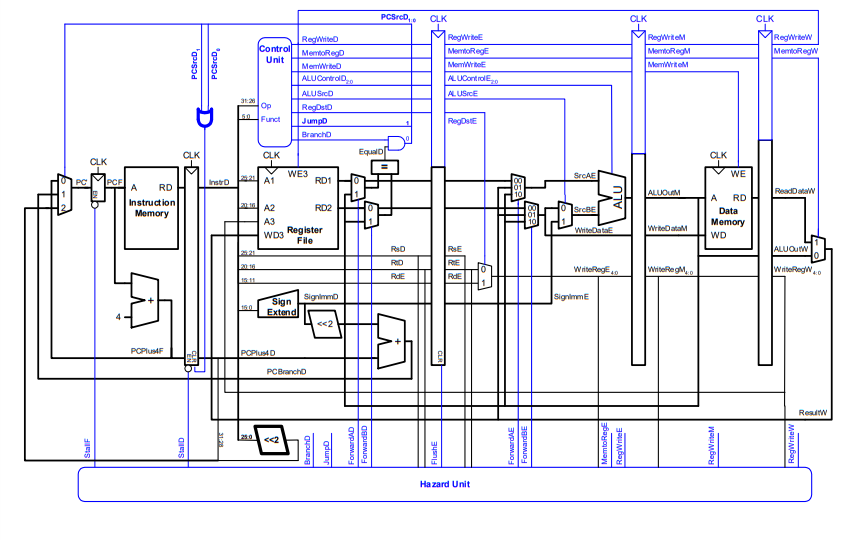
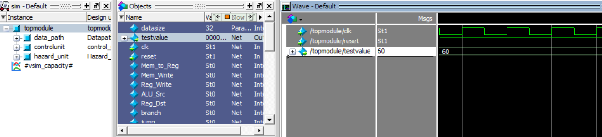
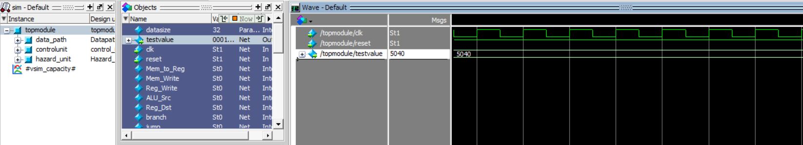

# Pipelined 32-bits MIPS processor with full hazard handling

### Introduction

A Pipelined 32-bit microarchitecture MIPS processor based on Harvard Architecture with full hazard handling both data and control hazards.

### Top Module View

### Final Simulation Results

- #### Program 1: GCD of 120 and 180

- #### Program 2: Factorial Number of 7

